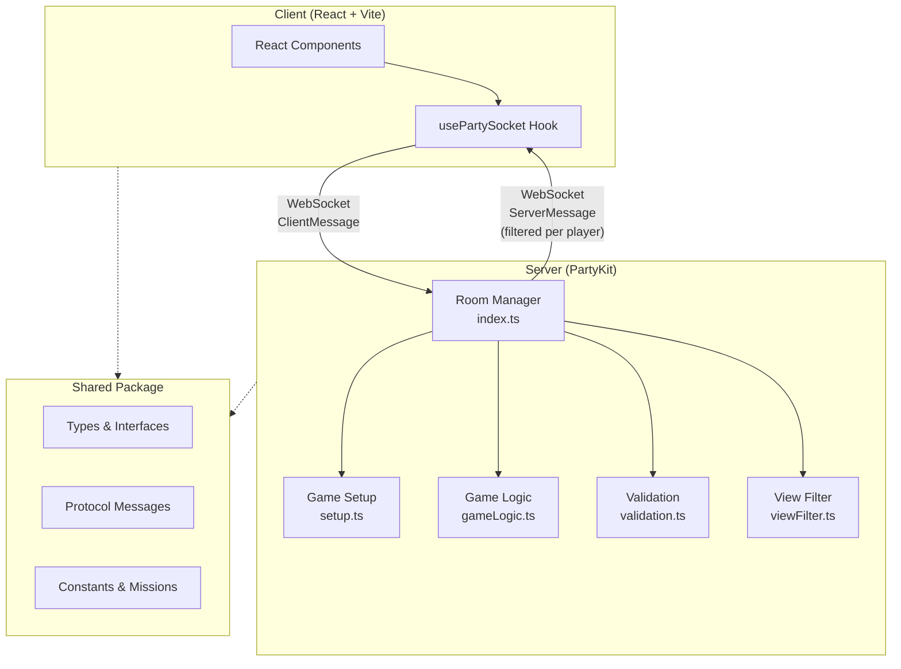
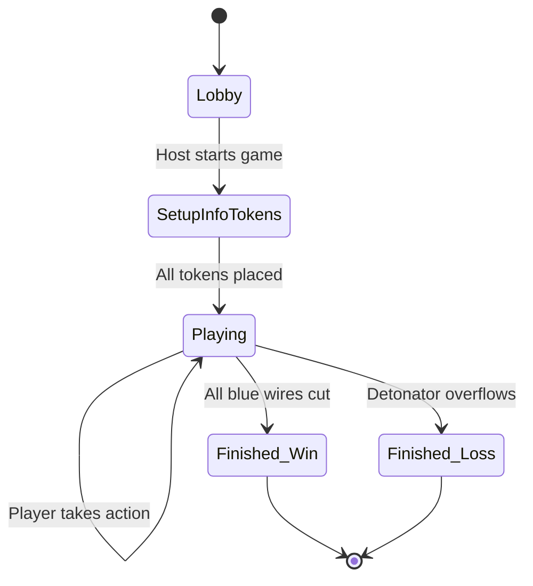
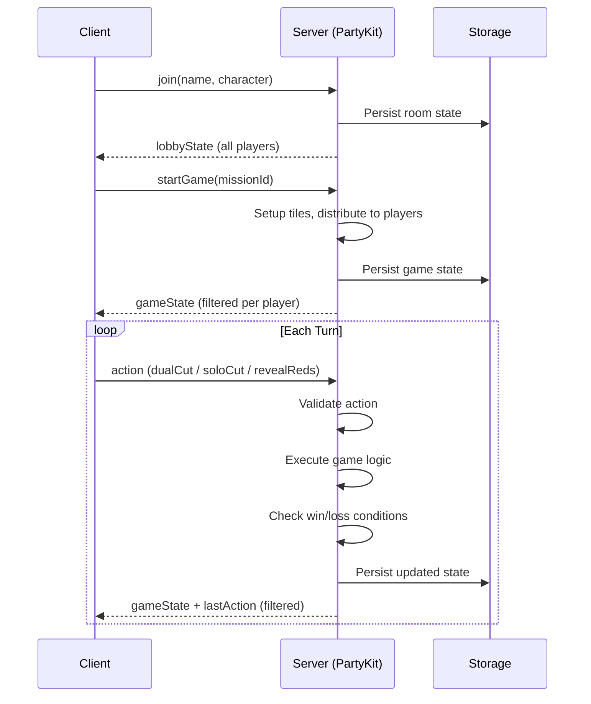
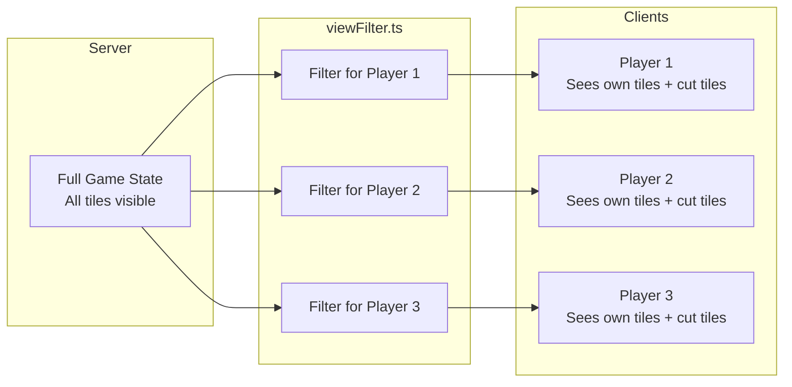

# Bomb Busters 💣

A cooperative multiplayer wire-cutting board game. Players work together to defuse a bomb by cutting wires — but you can't see your teammates' tiles, so communication and strategy are key.

Built with TypeScript, React, PartyKit, and Tailwind CSS.

## Getting Started

### Prerequisites

- [Node.js](https://nodejs.org/) (ES2022 compatible)
- [pnpm](https://pnpm.io/)

### Installation

```bash
pnpm install
```

### Development

```bash
# Run both client and server
pnpm dev:all

# Or run separately
pnpm dev              # Client on http://localhost:3000
pnpm dev:server       # Server on http://localhost:1999
```

### Production Build

```bash
pnpm build
```

## How to Play

1. **Create a room** — One player creates a game and shares the room code.
2. **Join** — Other players (2–5 total) join using the room code and pick a character.
3. **Select a mission** — The host picks a training mission (1–8, increasing difficulty).
4. **Place info tokens** — Each player places one info token on one of their own wires to give teammates a hint.
5. **Take turns** — On your turn, choose an action:
   - **Dual Cut** — Pick a tile from another player's hand and cut a matching wire from your own.
   - **Solo Cut** — Cut a wire if you hold all remaining copies of that value.
   - **Reveal Reds** — Reveal all red wires in your hand.
6. **Win or lose** — Cut all blue wires to win. Cut too many red wires and the detonator goes off!

## Architecture

### Monorepo Structure

```
packages/
├── shared/    # Types, protocol, game constants, missions
├── server/    # PartyKit WebSocket server (game logic)
└── client/    # React + Vite frontend
```

All packages reference shared types via `@bomb-busters/shared`.

### System Architecture



### Game State Flow



### Client-Server Communication



### Information Hiding Model

The core mechanic relies on hidden information. The server maintains the full game state but filters what each player can see:



- **Your own tiles**: fully visible (color, value)
- **Other players' tiles**: hidden until cut
- **Cut tiles**: visible to everyone
- **Info tokens**: visible hints placed during setup

### Server Module Responsibilities

| Module | Responsibility |
|---|---|
| `index.ts` | PartyKit Server class, message routing, room lifecycle, state broadcasting |
| `setup.ts` | Tile creation (blue/red/yellow), shuffling, round-robin distribution, equipment cards |
| `gameLogic.ts` | Action execution, turn advancement, validation track, win/loss detection |
| `validation.ts` | Pre-execution action validation (turn order, tile ownership, game rules) |
| `viewFilter.ts` | Per-player state filtering to enforce hidden information |

### Wire System

- **48 blue wires** — Values 1–12, 4 copies each. These are the target wires to cut.
- **11 red wires** — Danger wires. Cutting these advances the detonator.
- **11 yellow wires** — Special wires with unique effects.

Missions control the mix of wire types drawn from the pool, scaling difficulty from novice (mission 1) to expert (mission 8).

## Tech Stack

| Layer | Technology |
|---|---|
| Frontend | React 19, Vite 6, Tailwind CSS 4 |
| Backend | PartyKit (serverless WebSocket rooms) |
| Language | TypeScript 5.7 (strict mode) |
| Package Manager | pnpm workspaces |
| Real-time | WebSocket via PartySocket |

## Environment Variables

| Variable | Description | Default |
|---|---|---|
| `VITE_PARTYKIT_HOST` | PartyKit server URL | `localhost:1999` |

## Deployment

- **Server**: Deploy via `partykit deploy` (serverless, room data persists via PartyKit storage)
- **Client**: Standard Vite static build, host anywhere (Vercel, Netlify, etc.)

## TODO Automation (Codex)

Run one TODO task per Codex execution using the shared prompt file:

```bash
for i in {1..100}; do
  codex exec \
    --dangerously-bypass-approvals-and-sandbox \
    -m gpt-5.3-codex-spark \
    -c 'model_reasoning_effort="xhigh"' \
    - < PROMPT_TODO.md
done
```

Cleanup note: once every TODO task is complete, remove this section, delete `TODO.md`, and delete `PROMPT_TODO.md`.
